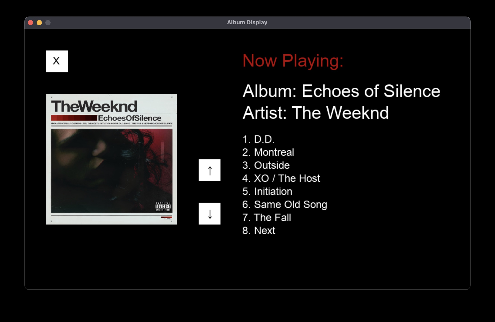

# Album Detector
Welcome to the Album Detector! This project was created using Spotify and OpenAI API services to allow users to detect an album through a camera and show a frontend view of the album and its tracklist. This is especially meant for those with a record player who wish to display their album that is currently playing.

## Use
Users can use the record_detect.py script to detect an album through their device's camera.

The requirements.txt can be used to create the corresponding python enviroment for this project.

pip install -r requirements.txt (Once an enviroment has been created and activated)

Users must pass the following enviroment variables: SPOTIFY_CLIENT_ID, SPOTIFY_CLIENT_SECRET, and OPENAI_API_KEY from thier respective API accounts.

Enviroment variables can be passed by running the following code in your enviroment's terminal: export SPOTIFY_CLIENT_ID="Insert-key-here"

Spotify's API can be authenticated through the terminal.

This code is designed to be ran on a raspberry pi, but can also work for other devices with cameras such as laptops

## Example Output
